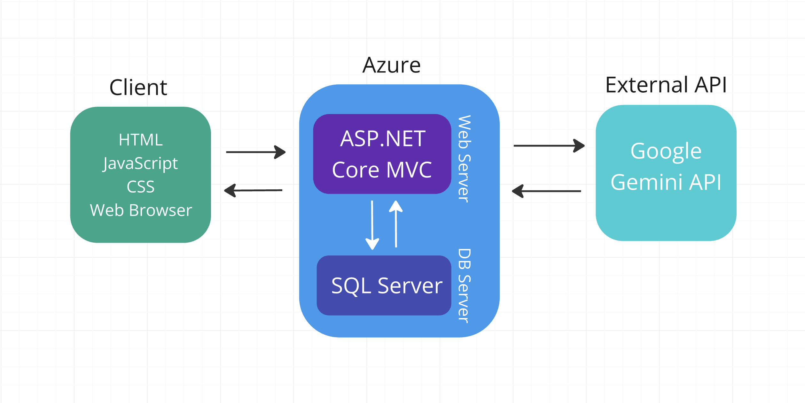

Project Inception Worksheet - Daily Journal / To Do / Habit Tracker
=====================================

## Summary of Our Approach to Software Development
    What processes are we following?  How will we run this project? ==> Agile, Scrum, ...  
    What are we choosing to do, how will we do it and at what level of detail or extent?

## Initial Vision Discussion with Stakeholders
    A web app that serves as a digital bullet journal for users, allowing them to log daily entries on thoughts, moods, habits, and tasks. AI integration is leveraged to enhance journal entries with personalized insights and interactions based on user entries. Users can customize their personal experience receive thoughtful prompts on mindfulness exercises or areas of reflection, or just feedback on how well they've been keeping up with habits or tasks recently. 
    Users will also be able to personally or automatically tag entries to seamlessly link them to related entries, or overarching topics or goals. The aim is a journal that facilitates personal growth and makes thoughtful reflection an easier part of a user's daily life.

### [Journal Mind Map - Miro](https://miro.com/app/board/uXjVLr9f9Ic=/?share_link_id=998678201110)

### Description of Clients/Users

### List of Stakeholders and their Positions (if applicable)
    Who are they? Why are they a stakeholder?

## Initial Requirements Elaboration and Elicitation
    See Requirements_template for more

### Elicitation Questions
    1. What information will a user be able to enter in the journal?
    2. What information will the AI take into consideration for its responses? 
    3. What types of interactions or responses will the AI offer?
    4. What would constitute a trend in user behavior, especially in terms of information and timeframes?
    5. How will notes or entries be tagged, and what's an example of a potential tag?
    6. Can a user get insights on both their entries and their recent habits?
    7. How will a user record different information like entries, recent habits, and task completion?

### Elicitation Interviews
    Transcript or summary of what was learned

### Other Elicitation Activities?
    As needed

## List of Needs and Features
    1. Users can record text and image inputs as daily journal entries.
    2. Users can define custom habits they are working to develop, and track their consistency in building these habits.
    3. Users can define one-off or recurring tasks they would like to complete, track their completion of tasks, and be reminded of upcoming tasks.
    4. The AI assistant will provide insights based on the content of recent entries, as well as recent performance in task completion or habit building.
    5. Trends in user behavior could be task completion or habit engagement rates, as well as recurring emotions or topics within entries.
    6. Timeframes for trends could be variable, with short term trends spanning over days, medium over weeks, and long term over months.
    7. Entries could be manually or automatically tagged (using AI) for traits such as context (work, school, life), content (specific subject, hobby, emotion), or other user-defined tags.
    8. Users can customize the level of interaction for AI insights, ranging from receiving prompts and responses for journal entries to receiving recognition for recent achievements in task completion or habit engagement. 

## Initial Modeling

### Use Case Diagrams
    Diagrams

### Sequence Diagrams

### Other Modeling
    Diagrams, UI wireframes, page flows, ...

## Identify Non-Functional Requirements
    1.
    2.
    3.

## Identify Functional Requirements (In User Story Format)

E: Epic  
U: User Story  
T: Task  

7. [E] 
    1. [U]
        a. [T]
        b. [T]
    2. [U]
        a. [T]

## Initial Architecture Envisioning
Rough Architure Diagram:

## Agile Data Modeling
    Diagrams, SQL modeling (dbdiagram.io), UML diagrams

## Timeline and Release Plan
    Schedule: meaningful dates, milestones, sprint cadence, how releases are made (CI/CD, or fixed releases, or ?)